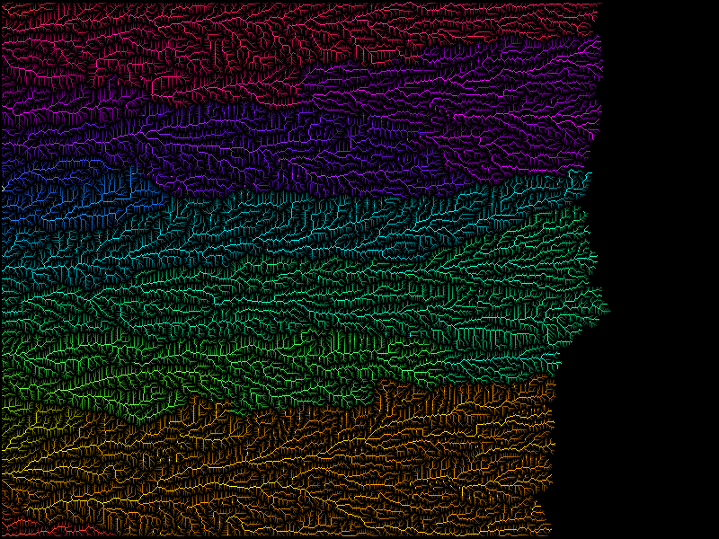
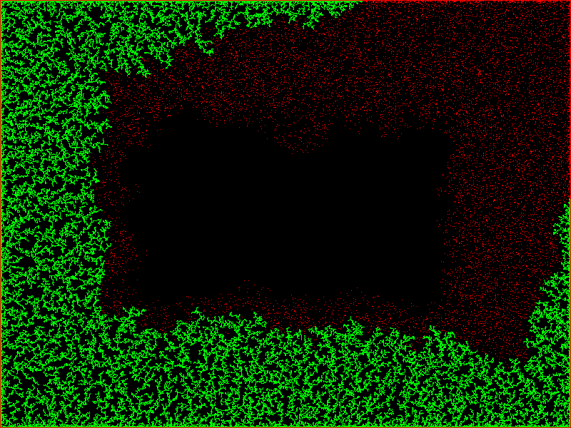
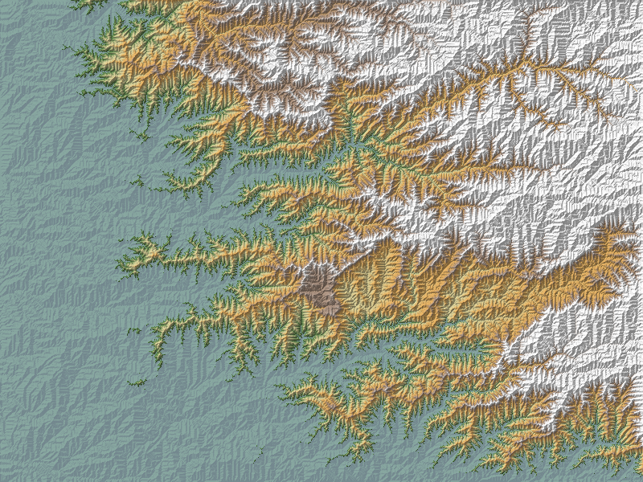
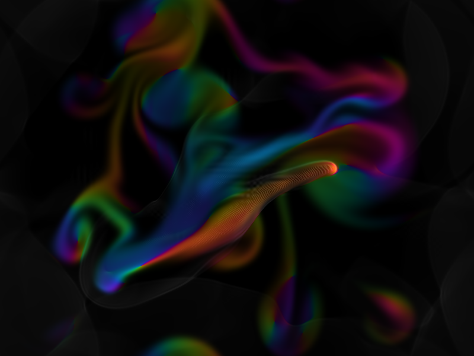
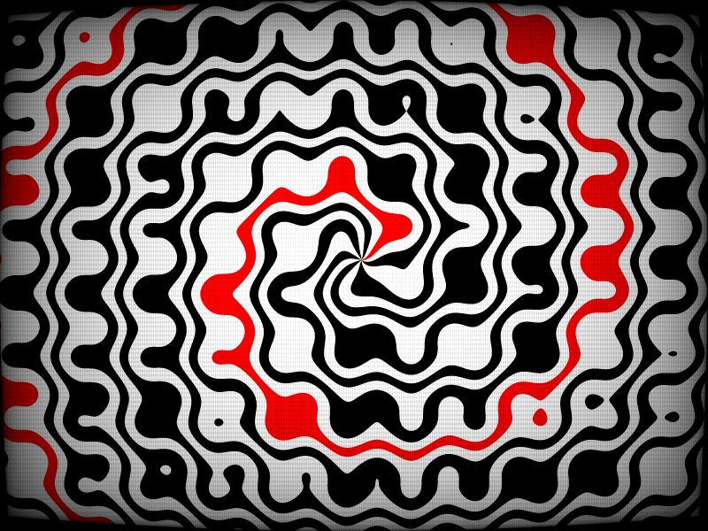
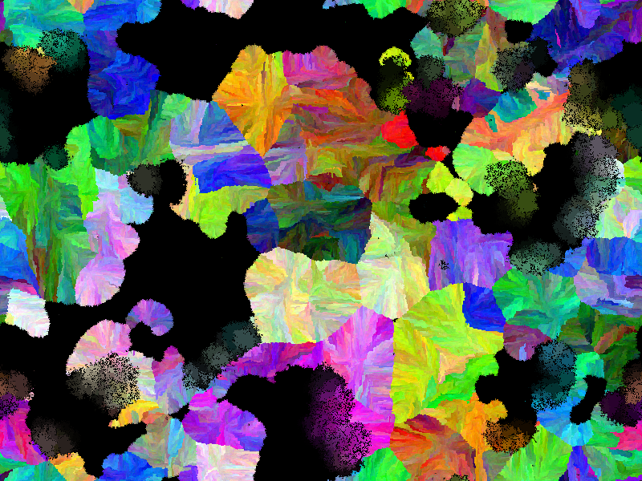
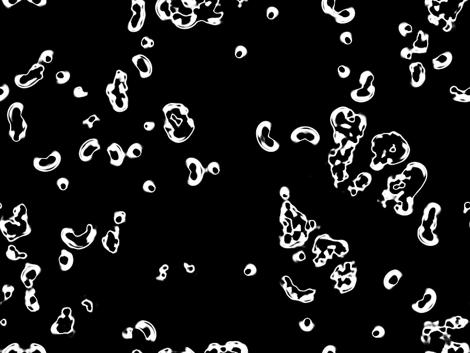
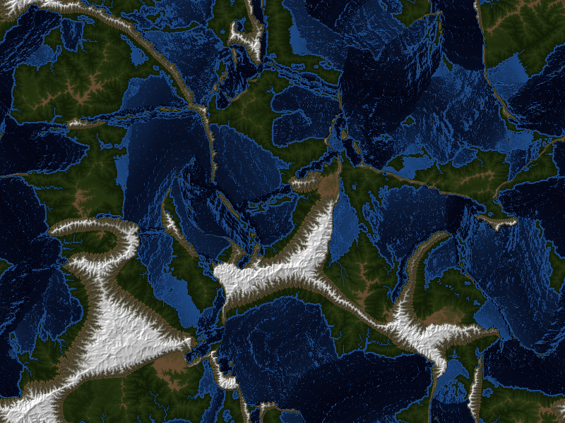
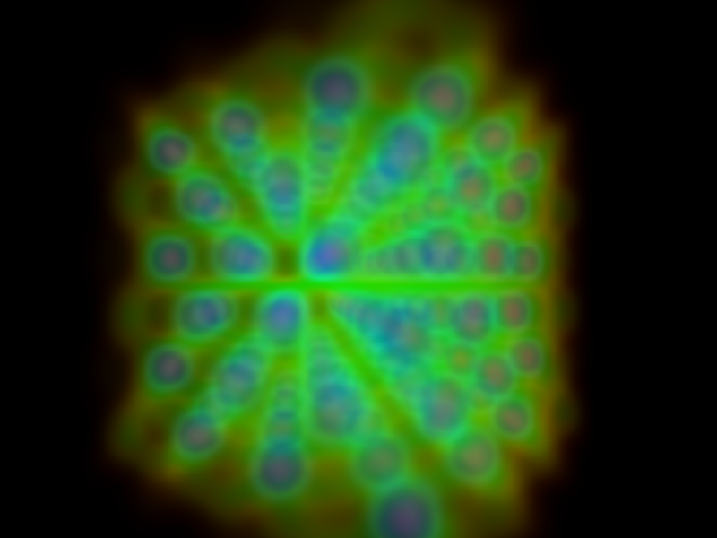
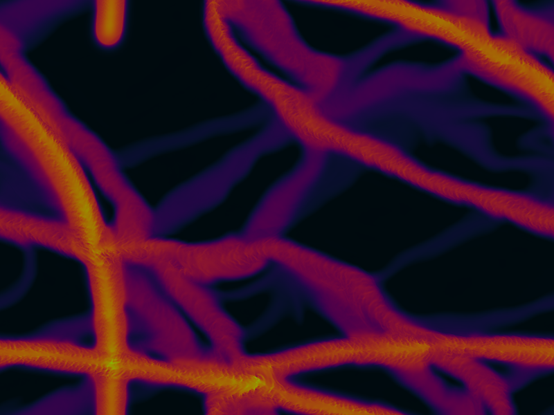

# fragx
GLSL Fragment Shader Executable Compiler

Use `make` to compile the examples, eg:

```sh
make bin/dla && bin/dla
```

## Screenshots

### basin


### dla


### double-slit


### erosion


### fluid


### grafeq


### huegene


### qm


### smoothlife


### tectonics-erosion


### volume


### vorticity

